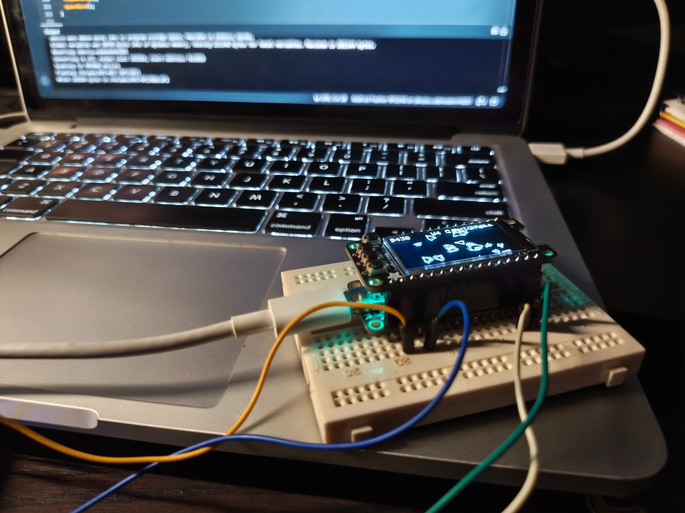

# Void Runner for Adafruit RP2040 + OLED Display

Horizontal side-scrolling shmup on a 128×64 SH1107 OLED FeatherWing.

## Demo

## Hardware

- **Board:** Adafruit Feather RP2040
- **Display:** 128×64 OLED FeatherWing (SH1107)
- **Core:** Earle Philhower Arduino core for RP2040

## Libraries

- Adafruit SH110x
- Adafruit GFX Library
- Adafruit BusIO
- Adafruit NeoPixel

## Build & upload

1. Open `rp2040_shmup.ino` in the Arduino IDE.
2. Select **Board → Adafruit Feather RP2040** (Philhower core).
3. Upload over USB.

## Controls

| Button | Action |
|--------|--------|
| **A** | Move up |
| **C** | Move down |
| **B** | Fire (hold for auto-fire) |
| **BOOT** | Bomb (limited) |
| **A / B / C** | Start / retry |

## Gameplay

Open space scroll with a sparse starfield. Enemies and powerups spawn from the right; difficulty ramps with distance.

Powerups: **S** spread, **R** rapid fire, **H** shield, **B** extra bomb.

## Setup

Feather RP2040 with OLED FeatherWing stacked, connected over USB.

